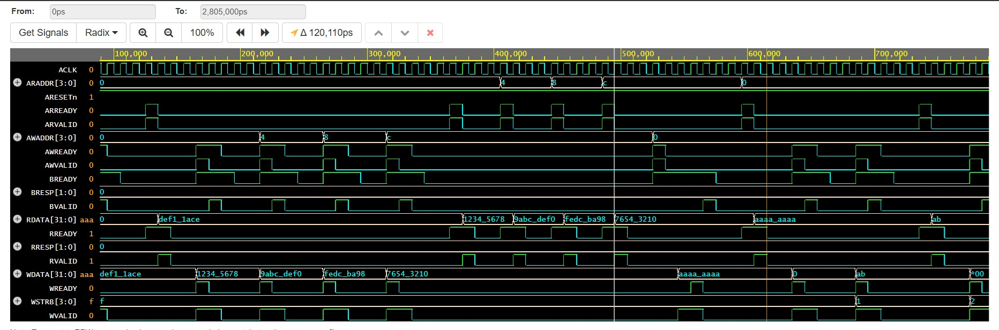

# AXI4-Lite Slave – RTL Design

A synthesizable AXI4-Lite slave peripheral written in SystemVerilog. It exposes four 32-bit memory-mapped registers and handles both simultaneous and pipelined address/data write scenarios, byte-lane strobes, and response signalling on both channels.

---

## Table of Contents

- [Overview](#overview)
- [Port List](#port-list)
- [Register Map](#register-map)
- [Architecture](#architecture)
  - [Write Path](#write-path)
  - [Read Path](#read-path)
- [Response Codes](#response-codes)
- [Waveform](#waveform)
- [Testbench](#testbench)
- [File Structure](#file-structure)
- [Simulation](#simulation)
- [Known Limitations](#known-limitations)

---

## Overview

| Parameter | Value |
|---|---|
| Protocol | AXI4-Lite |
| Data width | 32-bit |
| Address width | 4-bit |
| Number of registers | 4 × 32-bit |
| Clock | `ACLK` (rising edge) |
| Reset | `ARESETn` (active-low, synchronous) |

The design is intentionally minimal — no PROT signals, no caching attributes. It targets use cases where you need a small, clean register bank accessible over AXI4-Lite and don't need the overhead of a full interconnect implementation.

---

## Port List

### Global

| Signal | Dir | Width | Description |
|---|---|---|---|
| `ACLK` | in | 1 | System clock |
| `ARESETn` | in | 1 | Active-low synchronous reset |

### Write Address Channel

| Signal | Dir | Width | Description |
|---|---|---|---|
| `AWADDR` | in | 4 | Write address |
| `AWVALID` | in | 1 | Master asserts address is valid |
| `AWREADY` | out | 1 | Slave ready to accept address |

### Write Data Channel

| Signal | Dir | Width | Description |
|---|---|---|---|
| `WDATA` | in | 32 | Write data |
| `WSTRB` | in | 4 | Byte-lane write strobes |
| `WVALID` | in | 1 | Master asserts data is valid |
| `WREADY` | out | 1 | Slave ready to accept data |

### Write Response Channel

| Signal | Dir | Width | Description |
|---|---|---|---|
| `BRESP` | out | 2 | Write response code |
| `BVALID` | out | 1 | Response is valid |
| `BREADY` | in | 1 | Master ready to accept response |

### Read Address Channel

| Signal | Dir | Width | Description |
|---|---|---|---|
| `ARADDR` | in | 4 | Read address |
| `ARVALID` | in | 1 | Master asserts address is valid |
| `ARREADY` | out | 1 | Slave ready to accept address |

### Read Data Channel

| Signal | Dir | Width | Description |
|---|---|---|---|
| `RDATA` | out | 32 | Read data |
| `RRESP` | out | 2 | Read response code |
| `RVALID` | out | 1 | Read data is valid |
| `RREADY` | in | 1 | Master ready to accept data |

---

## Register Map

Address decoding uses bits `[3:2]` of the address, so each register sits on a 4-byte-aligned boundary.

| Address | Register | Reset Value |
|---|---|---|
| `0x0` | `regx[0]` | `0x00000000` |
| `0x4` | `regx[1]` | `0x00000000` |
| `0x8` | `regx[2]` | `0x00000000` |
| `0xC` | `regx[3]` | `0x00000000` |

Accesses to unaligned addresses (bits `[1:0] != 2'b00`) or addresses above `0xC` complete the transaction but return a `SLVERR` response. Register contents are not modified on such accesses.

---

## Architecture

### Write Path

The write channel uses a 3-state FSM:

```
WIDLE → WDATA → WRESP → WIDLE
```

**WIDLE** — The slave waits for `AWVALID`. If `AWVALID` and `WVALID` arrive simultaneously, it latches the address, writes the data (respecting `WSTRB`), and jumps straight to `WRESP`, skipping the intermediate state. If only `AWVALID` is seen, it latches the address and moves to `WDATA` to wait for data separately.

**WDATA** — Waits for `WVALID`, then performs the byte-lane-masked register write and advances to `WRESP`.

**WRESP** — Asserts `BVALID` with the appropriate response code and holds until `BREADY` is seen from the master. Returns to `WIDLE` once the handshake completes.

When `WSTRB` is all zeros, the write transaction completes normally (OKAY response) but register contents remain unchanged.

### Read Path

The read channel is a 2-state FSM:

```
RIDLE → RDATA → RIDLE
```

**RIDLE** — Waits for `ARVALID`, latches the address, asserts `ARREADY` for one cycle, and moves to `RDATA`.

**RDATA** — Drives `RDATA` from the addressed register and asserts `RVALID`. Holds until `RREADY` is seen, then returns to `RIDLE`. Response is `SLVERR` for unaligned or out-of-range addresses, `OKAY` otherwise.

The write and read FSMs run in parallel in separate `always` blocks, so read and write transactions do not block each other.

---

## Response Codes

| Code | Meaning | Condition |
|---|---|---|
| `2'b00` | OKAY | Valid aligned address within range |
| `2'b10` | SLVERR | Address > `0xC` or `addr[1:0] != 2'b00` |

---

## Waveform

The simulation waveform below shows a representative run captured with GTKWave. Visible transactions include simultaneous AW+W writes, separate address-then-data writes, byte strobe patterns, and error responses on unaligned addresses.



Key things to observe:
- `AWREADY` and `WREADY` pulse together on simultaneous transactions, or separately when address and data arrive in different cycles.
- `BVALID` follows after both address and data have been accepted, with `BRESP` set before the handshake.
- `RVALID` is asserted one cycle after `ARREADY`, with `RDATA` already stable on the bus.

---

## Testbench

The testbench (`testbench.sv`) exercises the DUT through a set of directed test scenarios using three reusable tasks:

| Task | Description |
|---|---|
| `axi_write_simul` | Issues AW and W simultaneously (most common case) |
| `axi_write_separate` | Issues AW first, then W in a later cycle |
| `axi_read` | Issues an AR transaction and captures returned data |

Test scenarios covered:

- **Basic write and read** — single write followed by readback on all four registers
- **Full register sweep** — write distinct values to all four addresses, verify each readback
- **Separate address/data writes** — verify the `WIDLE → WDATA` path works correctly
- **Byte strobes** — incremental byte-lane writes building up a full 32-bit word, plus non-contiguous strobe patterns
- **Unaligned addresses** — write and read to `0x1`, `0x2`, `0x3`, `0x5`; expect `SLVERR`, no data corruption
- **Out-of-range addresses** — accesses to `0xD`, `0xE`, `0xF`; expect `SLVERR`
- **Zero strobe** — `WSTRB=0` should leave register unchanged while returning OKAY
- **Back-to-back transactions** — four consecutive writes then four reads with no idle gaps
- **Reset during operation** — mid-run reset followed by readback to confirm all registers cleared to zero
- **Mixed read/write** — interleaved reads and writes confirming register isolation

Results are reported at the end with a pass/fail count. The VCD dump (`axi_lite_slave_tb.vcd`) is generated automatically for waveform viewing.

---

## File Structure

```
.
├── design.sv               # AXI4-Lite Slave RTL (synthesizable)
├── testbench.sv            # SystemVerilog testbench
├── axi_lite_slave_tb.vcd   # Simulation waveform dump
└── Waveform.jpg            # Waveform screenshot
```

---

## Simulation

The design was simulated using EDA Playground. To run locally with any standard SystemVerilog simulator:

**Icarus Verilog (iverilog):**
```bash
iverilog -g2012 -o sim.out design.sv testbench.sv
vvp sim.out
gtkwave axi_lite_slave_tb.vcd
```

**Questa / ModelSim:**
```bash
vlog design.sv testbench.sv
vsim -c axi_lite_slave_tb -do "run -all; quit"
```

**Xcelium:**
```bash
xrun design.sv testbench.sv -timescale 1ns/1ps
```

---

## Known Limitations

- **No PROT support** — `AWPROT` and `ARPROT` are not implemented. All accesses are treated as normal, non-secure, unprivileged.
- **No simultaneous read/write to same address ordering guarantee** — the two FSMs are independent; back-to-back read-after-write to the same address within the same clock cycle is not explicitly handled.
- **4-bit address space** — the address bus is only wide enough for the four registers. Extending to a wider address bus requires widening `AWADDR`/`ARADDR` and adjusting the decode logic.
- **Single outstanding transaction** — each channel's FSM processes one transaction at a time; there is no support for pipelined or out-of-order transactions (which is expected for AXI4-Lite).
